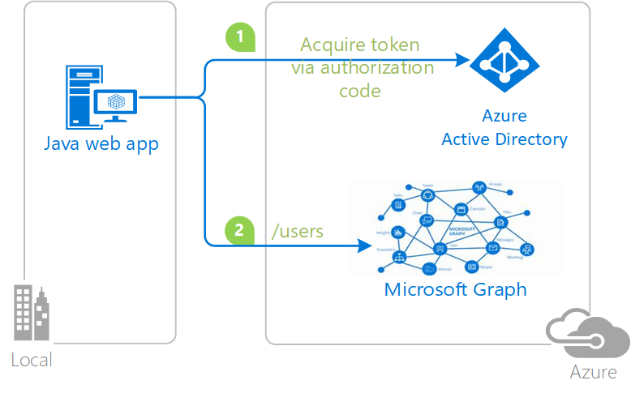

# Integrating Azure AD into a Java web application

## About this sample

### Overview

This sample demonstrates a Java web application calling a Microsoft Graph that is secured using Azure Active Directory.

1. The Java web application uses the Active Directory Authentication Library for Java(ADAL4J) to obtain a JWT access token from Azure Active Directory (Azure AD):
2. The access token is used as a bearer token to authenticate the user when calling the Microsoft Graph.

### Scenario

This sample shows how to build a Java web app(confidential client) that uses OpenID Connect to sign-in users from a single Azure Active Directory (Azure AD) tenant using ADAL4J. For more information about how the protocols work in this scenario and other scenarios, see [Authentication Scenarios for Azure AD](https://docs.microsoft.com/en-us/azure/active-directory/develop/active-directory-authentication-scenarios).

## How to run this sample

To run this sample, you'll need:

- Working installation of Java and Maven
- Tomcat or any other J2EE container solution
- An Internet connection
- An Azure Active Directory (Azure AD) tenant. For more information on how to get an Azure AD tenant, see [How to get an Azure AD tenant](https://azure.microsoft.com/en-us/documentation/articles/active-directory-howto-tenant/) 
- A user account in your Azure AD tenant. This sample will not work with a Microsoft account (formerly Windows Live account). Therefore, if you signed in to the [Azure portal](https://portal.azure.com) with a Microsoft account and have never created a user account in your directory before, you need to do that now.

### Step 1: Download Java (8 and above) for your platform

To successfully use this sample, you need a working installation of [Java](http://www.oracle.com/technetwork/java/javase/downloads/index.html) and [Maven](https://maven.apache.org/).

### Step 2:  Clone or download this repository

From your shell or command line:

- `git clone https://github.com/Azure-Samples/active-directory-java-webapp-openidconnect.git`

### Step 3:  Register the sample with your Azure Active Directory tenant

To register these projects, you can:

- either follow the steps in the paragraphs below 
- or use PowerShell scripts that:
  - **automatically** create for you the Azure AD applications and related objects (passwords, permissions, dependencies)

If you want to use this automation, read the instructions in [App Creation Scripts](./AppCreationScripts/AppCreationScripts.md). Please note that the configuration of your code (Step 4) still needs to be done manually. 

#### First step: choose the Azure AD tenant where you want to create your applications

As a first step you'll need to:

1. Sign in to the [Azure portal](https://portal.azure.com).
1. On the top bar, click on your account, and then on **Switch Directory**. 
1. Once the *Directory + subscription* pane opens, choose the Active Directory tenant where you wish to register your application, from the *Favorites* or *All Directories* list.
1. Click on **All services** in the left-hand nav, and choose **Azure Active Directory**.

> In the next steps, you might need the tenant name (or directory name) or the tenant ID (or directory ID). These are presented in the **Properties**
of the Azure Active Directory window respectively as *Name* and *Directory ID*

#### Register the app app (Webapp-Openidconnect)

1. In the  **Azure Active Directory** pane, click on **App registrations** and choose **New application registration**.
1. Enter a friendly name for the application, for example 'Webapp-Openidconnect' and select 'Web app / API' as the *Application Type*.
1. For the *sign-on URL*, enter the base URL for the sample. By default, this sample uses `https://localhost:8000/`.
1. Click **Create** to create the application.
1. In the succeeding page, Find the *Application ID* value and and record it for later. You'll need it to configure the configuration file for this project.
1. Then click on **Settings**, and choose **Properties**.
1. For the App ID URI, replace the guid in the generated URI 'https://\<your_tenant_name\>/\<guid\>', with the name of your service, for example, 'https://\<your_tenant_name\>/Webapp-Openidconnect' (replacing `<your_tenant_name>` with the name of your Azure AD tenant)
1. Click on **Redirect URIs** and set it to `https://localhost:8000/adal4jsample/secure/aad`
1. From the Settings menu, choose **Keys** and add a new entry in the Password section:

   - Type a key description (of instance `app secret`),
   - Select a key duration of either **In 1 year**, **In 2 years**, or **Never Expires**.
   - When you save this page, the key value will be displayed, copy, and save the value in a safe location.
   - You'll need this key later to configure the project. This key value will not be displayed again, nor retrievable by any other means, so record it as soon as it is visible from the Azure portal.
1. Configure Permissions for your application. To that extent, in the Settings menu, choose the 'Required permissions' section and then,
   click on **Add**, then **Select an API**, and type `Microsoft Graph` in the textbox. Then, click on  **Select Permissions** and select **Read directory data** under **APPLICATION PERMISSIONS**.
   - Note that for **Read directory data** requires the user grating the
     permission to be a tenant administrator. If you created an AzureAD tenant
     as part of the sample, you will be an administrator by default. 

### Step 4:  Configure the sample to use your Azure AD tenant

Open `web.xml` in the webapp/WEB-INF/ folder. Fill in with your tenant and app registration information noted in registration step. Replace 'YOUR_TENANT_NAME' with the tenant domain name, 'YOUR_CLIENT_ID' with the Application Id and 'YOUR_CLIENT_SECRET' with the key value noted.

### Step 5: Package and then deploy the adal4jsample.war file.

- `$ mvn compile -DgroupId='com.microsoft.azure' -DartifactId=adal4jsample -DinteractiveMode=false`

- `$ mvn package`

This will generate a `adal4jsample.war` file in your /targets directory. Deploy this war file using Tomcat or any other J2EE container solution. 

To deploy on Tomcat container
- Navigate to your Tomcat installation (default installation on windows is `C:\Program Files\Apache Software Foundation\Tomcat`)
- copy the `adal4jsample.war` file to the Tomcat\webapps folder 
- Start the Tomcat server. One way to do this is by opening the Monitor Tomcat app, clicking on `start` in the `General` tab

This WAR will automatically be hosted at `http://<yourserverhost>:<yourserverport>/adal4jsample/`

Example: `http://localhost:8080/adal4jsample/`

### You're done!

Click on "Show users in the tenant" to start the process of logging in.

## Community Help and Support

Use [Stack Overflow](http://stackoverflow.com/questions/tagged/adal) to get support from the community.
Ask your questions on Stack Overflow first and browse existing issues to see if someone has asked your question before.
Make sure that your questions or comments are tagged with [`adal` `Java`].

If you find a bug in the sample, please raise the issue on [GitHub Issues](../../issues).

To provide a recommendation, visit the following [User Voice page](https://feedback.azure.com/forums/169401-azure-active-directory).

## Contributing

If you'd like to contribute to this sample, see [CONTRIBUTING.MD](/CONTRIBUTING.md).

This project has adopted the [Microsoft Open Source Code of Conduct](https://opensource.microsoft.com/codeofconduct/). For more information, see the [Code of Conduct FAQ](https://opensource.microsoft.com/codeofconduct/faq/) or contact [opencode@microsoft.com](mailto:opencode@microsoft.com) with any additional questions or comments.

## More information

For more information, see ADAL4J [conceptual documentation](https://github.com/AzureAD/azure-activedirectory-library-for-java/wiki)

For more information about how OAuth 2.0 protocols work in this scenario and other scenarios, see [Authentication Scenarios for Azure AD](http://go.microsoft.com/fwlink/?LinkId=394414).
